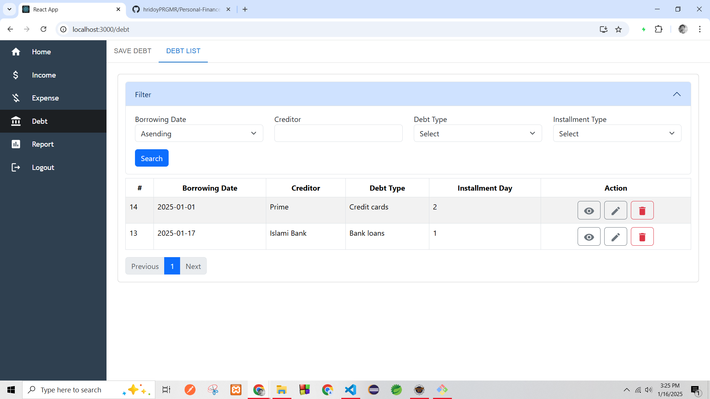
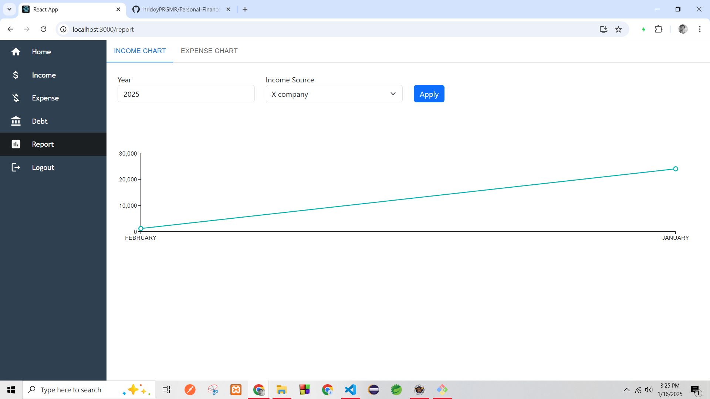

# Personal Finance Tracker

A secure and user-friendly web application designed to help users manage their personal finances effectively. This application allows users to track their income, expenses, debts, and more, with real-time currency exchange rates and powerful data visualization features.

## Features

- **Authentication**: Secure JWT-based authentication to protect user data.
- **Financial Management**: Track income, expenses, and debts with filtering and categorization options.
- **Data Visualization**: Visualize income and expenses with easy-to-understand charts and graphs.
- **Real-Time Currency Rates**: Integration with a third-party API to get real-time currency exchange rates.
- **Efficient Data Handling**: Built with RESTful APIs to ensure seamless communication between the frontend and backend.

## Technologies Used

- **Backend**: 
  - Spring Boot
  - Hibernate JPA
  - MySQL
- **Frontend**: 
  - React
  - Bootstrap
  - HTML
  - CSS
- **Authentication**: JWT (JSON Web Tokens)

## Setup Instructions

### Prerequisites
Before you begin, ensure you have the following installed:

- JDK 21 or higher
- MySQL
  
## Project Screenshots

  
  
  
  
  
  
  

